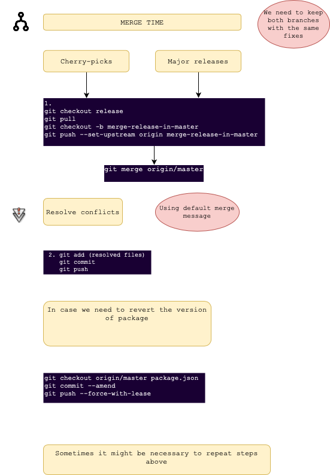

# Contributing to NativeScript Angular

:+1: First of all, thank you for taking the time to contribute! :+1:

Here are some guides on how to do that:

<!-- TOC depthFrom:2 -->

- [Code of Conduct](#code-of-conduct)
- [Reporting Bugs](#reporting-bugs)
- [Requesting Features](#requesting-features)
- [Submitting a PR](#submitting-a-pr)
- [Where to Start](#where-to-start)
- [Publishing new versions](#publishing-new-versions)

<!-- /TOC -->

##  Code of Conduct
Help us keep a healthy and open community. We expect all participants in this project to adhere to the [NativeScript Code Of Conduct](https://github.com/NativeScript/codeofconduct).


## Reporting Bugs

1. Always update to the most recent master release; the bug may already be resolved.
2. Search for similar issues in the issues list for this repo; it may already be an identified problem.
3. If this is a bug or problem that is clear, simple, and is unlikely to require any discussion -- it is OK to open an issue on GitHub with a reproduction of the bug including workflows and screenshots. If possible, submit a Pull Request with a failing test, entire application or module. If you'd rather take matters into your own hands, fix the bug yourself (jump down to the [Submitting a PR](#submitting-a-pr) section).

## Requesting Features

1. Use Github Issues to submit feature requests.
2. First, search for a similar request and extend it if applicable. This way it would be easier for the community to track the features.
3. When requesting a new feature, please provide as much detail as possible about why you need the feature in your apps. We prefer that you explain a need rather than explain a technical solution for it. That might trigger a nice conversation on finding the best and broadest technical solution to a specific need.

## Submitting a PR

Before you begin:
* Read and sign the [NativeScript Contribution License Agreement](http://www.nativescript.org/cla).
* Make sure there is an issue for the bug or feature you will be working on.

Following these steps is the best way to get you code included in the project:

1. Fork and clone the nativescript-angular repo:
```bash
git clone https://github.com/<your-git-username>/nativescript-angular.git
# Navigate to the newly cloned directory
cd nativescript-angular
# Add an "upstream" remote pointing to the original repo.
git remote add upstream https://github.com/NativeScript/nativescript-angular.git
```

2. Read our [development workflow guide](DevelopmentWorkflow.md) for local setup:

3. Create a branch for your PR
```bash
git checkout -b <my-fix-branch> master
```

4. The fun part! Make your code changes. Make sure you:
    - Follow the [code conventions guide](https://github.com/NativeScript/NativeScript/blob/master/CodingConvention.md).
    - Write unit tests for your fix or feature.

5. Before you submit your PR:
    - Rebase your changes to the latest master: `git pull --rebase upstream master`.
    - Ensure all unit test are green. Check [running unit tests](DevelopmentWorkflow.md#running-the-tests).
    - Ensure your changes pass tslint validation. (run `npm run tslint` in the root of the repo).

6. Push your fork. If you have rebased you might have to use force-push your branch:
```
git push origin <my-fix-branch> --force
```

7. [Submit your pull request](https://github.com/NativeScript/nativescript-angular/compare). Please, fill in the Pull Request template - it will help us better understand the PR and increase the chances of it getting merged quickly.

It's our turn from there on! We will review the PR and discuss changes you might have to make before merging it! Thanks! 


## Where to Start

If you want to contribute, but you are not sure where to start - look for [issues labeled `help wanted`](https://github.com/NativeScript/nativescript-angular/issues?q=is%3Aopen+is%3Aissue+label%3A%22help+wanted%22).


## Publishing new versions


## <a name="release"></a> Releasing new versions
Instructions how to release a new version for **NativeScript Core Team Members**.


1. Checkout release branch
```
cd nativescript-angular/nativescript-angular && git checkout release && git pull
```
#### If we prepare major or minor release, merge master in release branch else **skip this step**.
```
git merge --ff-only origin/master
```
*** Note: If there are commits in release branch which are not merged in master branch '-ff-merge' command will fail. 
In this case the commits should be merge firstly from release in master branch as explained in section 'Merge changes from release into master' and then repeat step 1.

2. Execute `npm i` to install dependencies:
```
cd nativescript-angular && npm i
```
3. Execute [`npm version`](https://docs.npmjs.com/cli/version) to bump the version:
```
npm --no-git-tag-version version [patch|minor|major] -m "release: cut the %s release"
```
or
```
npm --no-git-tag-version version [version] --allow-same-version -m "release: cut the %s release"
```
NOTE: Check the changelog!!!

4. Create release-branch with change log
```
git checkout -b release-[version]
```
5. Add changes
```
git add changed-files
git commit -m "release: cut the %s release"
git push
```
NOTE: Make sure the PR is based on release branch

6. Merge PR into release branch.

7. The merge will produce package with rc tag in npm. If all checks have passed, publish official package. Usually the night builds will be triggered and the package will be ready to be released on the next day. 

8. Don't forget to tag the release branch 
```
git tag [version]
git push --tags
```
Only if needed to Tips to remove tags: 
```
git push --delete origin [version]
git tag -d [version]
```

## Checkout master branch and bump version usually should be minor or major.

## Merge changes from release into master

## NOTE: Don't use git IDE/WEB



### Here are steps described in the diagram above.

1. Make sure you are in release branch:
```
git checkout release && git pull
```
2. Create PR to merge changes back in master and preserve history:
```
git checkout -b merge-release-in-master-[branch]/[sha]
git push --set-upstream origin merge-release-in-master-branch-[branch]/[sha]
git merge origin/master
```
3. Resolve conflicts. Choose to keep the version of master branch. If it is needed to revert versions of modules, see at the bottom.

4. Add conflicts:
```
git add resolved files
```
5. Commit changes with default merge message:
```
git commit
git push
```

6. Create pull request which should be based on master. Replace replace env merge-release-in-master-branch with its value
```
curl -d '{"title": "chore: merge release in master","body": "chore: merge release in master","head": "merge-release-in-master","base": "master"}' -X POST https://api.github.com/repos/NativeScript/NativeScript/pulls -H "Authorization: token ${GIT_TOKEN}"
```

**If needed, to revert file and take it from master:**
```
git checkout origin/master nativescript-angular/[some-file]
git commit --amend
git push --force-with-lease
```
This could require to repeat steps from 1 to 4, since we need to keep the branches with the same history
